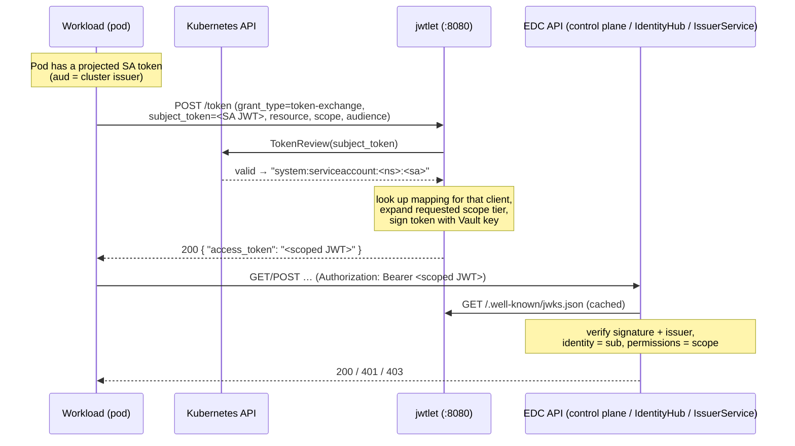

# Service-to-service authentication: token exchange with jwtlet

## Introduction

With recent development iterations, JAD has adopted the concept of workload identifiers over client-based
authentication. In practice, this means that each client app that wants to use any of EDC's administrative APIs must be
registered with Kuberentes to receive a workload token. It then exchanges this workload token for a participant-bound
token using OAuth2 Token Exchange (RFC 8693) via the `jwtlet` application.

This removes the need to store client credentials in every client app, such as Bruno, Redline, or others.

JAD has **two** complementary authentication paths:

| Path                   | For                                                                                       | Mechanism                                                                                                                       | Where it's documented                          |
|------------------------|-------------------------------------------------------------------------------------------|---------------------------------------------------------------------------------------------------------------------------------|------------------------------------------------|
| **External / human**   | UI users and operators reaching the APIs through the `jad.localhost` gateway              | Traefik `ForwardAuth` → `clearglass` validates the Bearer token against **Keycloak** (RFC 7662 introspection) and checks scopes | [README → Clearglass](../README.md#clearglass) |
| **Internal / machine** | In-cluster workloads (CFM agents, seed jobs, your own apps) calling the EDC APIs directly | **jwtlet** exchanges a Kubernetes ServiceAccount token for a short-lived, scoped EDC token (RFC 8693)                           | **this document**                              |

This document covers the **machine path**: the token-exchange mechanism, the `jwtlet` application and its APIs, the
scope model, and how to onboard a new client application.

---

## 1. Why token exchange?

Every in-cluster workload already has an identity: its **Kubernetes ServiceAccount**, presented as a projected
ServiceAccount JWT. Rather than provisioning and rotating a static OAuth2 client secret for each workload, JAD lets a
workload **exchange** its ServiceAccount identity for a narrowly-scoped, short-lived EDC access token.

`jwtlet` (`ghcr.io/eclipse-cfm/jwtlet`, a small Rust service from the [eclipse-cfm](https://github.com/eclipse-cfm)
project) is the OAuth2 **issuer** that the EDC components trust. The control plane, IdentityHub, and IssuerService are
all configured with jwtlet as their issuer and JWKS source — for example in
[`k8s/apps/edc/controlplane-config.yaml`](../k8s/apps/edc/controlplane-config.yaml):

```yaml
edc.iam.oauth2.issuer: "http://jwtlet.edc-v.svc.cluster.local:8080"
edc.iam.oauth2.jwks.url: "http://jwtlet.edc-v.svc.cluster.local:8080/.well-known/jwks.json"
```

(The same two settings appear in `identityhub-config.yaml` and `issuerservice-config.yaml`.) Each service therefore
verifies incoming tokens against jwtlet's published keys, reads the caller identity from the `sub` claim, and authorizes
the request against the `scope` claim.

---

## 2. The token-exchange mechanism (RFC 8693)



### The exchange request

The canonical example lives in
[`k8s/apps/edc/issuerservice-seed-job.yaml`](../k8s/apps/edc/issuerservice-seed-job.yaml):

```shell
curl -X POST "http://jwtlet.edc-v.svc.cluster.local:8080/token" \
  -H "Content-Type: application/x-www-form-urlencoded" \
  --data-urlencode "grant_type=urn:ietf:params:oauth:grant-type:token-exchange" \
  --data-urlencode "subject_token=${SA_TOKEN}" \
  --data-urlencode "resource=issuer" \
  --data-urlencode "scope=admin" \
  --data-urlencode "audience=edcv"
# → { "access_token": "<scoped JWT>", ... }
```

| Parameter       | Meaning                                                                                                     |
|-----------------|-------------------------------------------------------------------------------------------------------------|
| `grant_type`    | always `urn:ietf:params:oauth:grant-type:token-exchange`                                                    |
| `subject_token` | the workload's **projected Kubernetes ServiceAccount token**                                                |
| `resource`      | selects which of the caller's mappings to use; its `participantContext` becomes the issued token's `sub`    |
| `scope`         | the abstract scope **tier** to request — `read`, `write` or `admin` (expanded into concrete scopes, see §4) |
| `audience`      | the audience to mint the token for; must match jwtlet's configured `[token].audience` (`edcv`)              |

### The resulting token

The exchanged JWT is signed by jwtlet (key material from Vault) and carries:

- `iss` — jwtlet (`http://jwtlet…:8080`)
- `sub` — the `participantContextID` from the matching mapping (the EDC participant-context identity), the `resource`
  parameter from before
- `aud` — the requested `audience` (`edcv`)
- `scope` — the **expanded** scope string, e.g. `management-api:admin identity-api:admin issuer-admin-api:admin`

### ⚠️ The two audiences (common pitfall)

There are two distinct audiences and both must line up:

1. The **subject token** (the SA JWT) must be projected with the audience jwtlet expects for incoming tokens — jwtlet's
   `[token].client_audience`, i.e. the Kubernetes cluster issuer
   `https://kubernetes.default.svc.cluster.local`.
2. The **requested** `audience` parameter must equal jwtlet's `[token].audience` (`edcv`), which is the audience the EDC
   services accept. Currently, this is the same value (`"edcv"`) for all administrative APIs.

Each application or service that has a workload ID, and is thus able to exchange their workload token for a narrowly
scoped participant-bound token, must have a Kubernetes ServiceAccount and reads the service account token from a mapped
volume. The projected-token volume in the seed jobs shows how to request the right subject-token audience:

```yaml
volumes:
  - name: jwtlet-subject-token
    projected:
      sources:
        - serviceAccountToken:
            path: token
            audience: https://kubernetes.default.svc.cluster.local   # == jwtlet client_audience
            expirationSeconds: 3600
```

---

## 3. The jwtlet application and its APIs

`jwtlet` is deployed by [`k8s/base/security/jwtlet.yaml`](../k8s/base/security/jwtlet.yaml) and exposes **two ports**:

| Port   | Name             | Purpose                                               |
|--------|------------------|-------------------------------------------------------|
| `8080` | `token-exchange` | the public token endpoint + discovery + health        |
| `8081` | `management`     | the administrative API used to manage exchange policy |

It uses a PostgreSQL backend for its state and a **Vault** agent sidecar that supplies the signing key (the
`/vault/secrets/.vault-token` is produced by the agent and consumed by the jwtlet container). It validates incoming
subject tokens through the Kubernetes **TokenReview** API; the required RBAC is granted by the
`jwtlet-token-reviewer-binding` ClusterRoleBinding in
[`k8s/base/security/jwtlet-service-accounts.yaml`](../k8s/base/security/jwtlet-service-accounts.yaml).

### 3.1 Token-exchange API (port 8080)

| Method & path                | Purpose                                                                 |
|------------------------------|-------------------------------------------------------------------------|
| `POST /token`                | RFC 8693 token exchange (see §2)                                        |
| `GET /.well-known/jwks.json` | published public keys; used by the EDC services to verify issued tokens |
| `GET /health`                | liveness / readiness probe                                              |

### 3.2 Management API (port 8081, base path `/api/v1`)

The management API administers the exchange policy. This defines which client app can exchange their subject token for a
participant-scoped token, and which claims are mapped into that token. Callers authenticate with their **Kubernetes
ServiceAccount token** (projected with the cluster-issuer audience) and are authorized via jwtlet's own management
scopes (see §4.1).

| Method & path           | Purpose                                                                                                                  |
|-------------------------|--------------------------------------------------------------------------------------------------------------------------|
| `POST /api/v1/mappings` | bind a client (a K8s ServiceAccount) to a participant context, the scope tiers it may request, and the allowed audiences |
| `POST /api/v1/scopes`   | define how an abstract scope tier expands into a concrete `scope` claim                                                  |

> Read operations are gated by the `jwtlet:management:read` scope. The seed job
> [`k8s/base/security/jwtlet-seed-job.yaml`](../k8s/base/security/jwtlet-seed-job.yaml) is the canonical example of
> driving this API.

### 3.3 Configuration (`jwtlet.toml`)

Provided by the `jwtlet-config` ConfigMap in
[`k8s/base/security/jwtlet-config.yaml`](../k8s/base/security/jwtlet-config.yaml):

```toml
# this defines the value of the `iss` claim in issued/exchanged tokens
issuer = "http://jwtlet.edc-v.svc.cluster.local:8080"

# ...
# static grants for the MANAGEMENT API (see §4.1)
"system:serviceaccount:edc-v:cfm-agents" = ["jwtlet:management:mappings:write", "jwtlet:management:scope:write", "jwtlet:management:read"]
"system:serviceaccount:edc-v:seed-jobs" = ["jwtlet:management:mappings:write", "jwtlet:management:scope:write", "jwtlet:management:read"]
```

---

## 4. Scope mechanisms

There are **two independent scope systems**. Don't confuse them.

### 4.1 jwtlet management scopes — *who may manage/manipulate jwtlet*

These gate jwtlet's own management API (§3.2). They follow the grammar `jwtlet:management:[resource:]action` and are
granted **statically** in the `[service_accounts]` table of `jwtlet.toml`, which maps a Kubernetes ServiceAccount to a
set of management scopes.

| Scope                              | Allows                                                              |
|------------------------------------|---------------------------------------------------------------------|
| `jwtlet:management:mappings:write` | create/update client→context **mappings** (`POST /api/v1/mappings`) |
| `jwtlet:management:scope:write`    | create/update **scope mappings** (`POST /api/v1/scopes`)            |
| `jwtlet:management:read`           | read management resources                                           |

Notably, the scopes here are **not** hierarchical, i.e., having the `jwtlet:management:mappings:write` scope does
**not** imply the `"..:read"` scope.

### 4.2 EDC API scopes — *what an exchanged token may do*

These are the scopes carried in the **issued/exchanged** token and enforced by the EDC services. They are produced by a
**two-level** model:

**(a) A mapping** (`POST /api/v1/mappings`) binds a client to a participant context and lists the scope **tiers** it may
request. This defines *who* may exchange the token. For example:

```json
{
  "clientIdentifier": "system:serviceaccount:edc-v:seed-jobs",
  "participantContext": "your-new-participant-context-id",
  "scopes": [
    "read",
    "write"
  ],
  "audiences": [
    "edcv"
  ]
}
```

| Field                | Meaning                                                                            |
|----------------------|------------------------------------------------------------------------------------|
| `clientIdentifier`   | the calling Kubernetes ServiceAccount (`system:serviceaccount:<namespace>:<name>`) |
| `participantContext` | the identity placed in the token's `sub` claim                                     |
| `scopes`             | the abstract tiers this client may request via the `scope=` exchange parameter     |
| `audiences`          | the audiences this client may request                                              |

**(b) A scope mapping** (`POST /api/v1/scopes`) defines how each abstract tier **expands** into the concrete claim. For
example:

```json
{
  "scope": "read",
  "claims": {
    "scope": "management-api:ead identity-api:read issuer-admin-api:read"
  }
}
```

This means that the abstract `read` scope in the resource mapping is expanded into a
`"scope": "management-api:ead identity-api:read issuer-admin-api:read"` claim in the resulting exchanged token.

The following table illustrates all of those scope mappings as they are created by the `jwtlet-seed-job.yaml`:

| Tier    | Concrete `scope` claim minted into the token                     |
|---------|------------------------------------------------------------------|
| `read`  | `identity-api:read management-api:read issuer-admin-api:read`    |
| `write` | `identity-api:write management-api:write issuer-admin-api:write` |
| `admin` | `management-api:admin identity-api:admin issuer-admin-api:admin` |

The concrete scopes follow the EDC scope grammar `<api>:[resource:]action`:

- **namespaces** — `management-api` (control plane), `identity-api` (IdentityHub), `issuer-admin-api` (IssuerService).
- **actions** form a hierarchy: `admin ⊇ write ⊇ read` (a `write` grant also satisfies `read`; `admin` satisfies
  everything and additionally bypasses the per-tenant ownership check).
- the optional `resource` segment allows narrowing later (e.g. `identity-api:dids:write`) without changing endpoints;
  the coarse forms above satisfy the per-resource requirements via the resource wildcard.

At the gateway, the Traefik `jwt-auth-*` middlewares additionally enforce the coarse `read`/`write` scopes per API (see
[README → Auth middleware scopes](../README.md#auth-middleware-scopes)); the EDC services enforce the same scopes
internally.

---

## 5. Onboard a new client application

Goal: a new in-cluster workload `my-app` obtains scoped EDC tokens using its ServiceAccount. This `my-app` then reads
the SA token, exchanges it for a participant-scoped token, and executes requests against EDC's administrative APIs. The
steps below adapt the patterns already used by the CFM agents and seed jobs.

### Step 1 — Create a ServiceAccount

```yaml
apiVersion: v1
kind: ServiceAccount
metadata:
  name: my-app
  namespace: edc-v
```

No extra RBAC is needed for the *subject* identity: jwtlet validates **any** SA token via TokenReview using its own
permissions, so you do not grant `my-app` anything cluster-wide.

### Step 2 — Project a subject token into the pod

Mount a projected ServiceAccount token whose audience matches jwtlet's `client_audience`:

```yaml
volumes:
  - name: jwtlet-subject-token
    projected:
      sources:
        - serviceAccountToken:
            path: token
            audience: https://kubernetes.default.svc.cluster.local
            expirationSeconds: 3600
# ...and mount it, e.g. at /var/run/secrets/jwtlet (readOnly)
```

### Step 3 — Register a mapping in `jwtlet`

Call the jwtlet management API **as a caller that holds `jwtlet:management:mappings:write`** (e.g. from a seed Job that
runs as the `seed-jobs` ServiceAccount or as the `cfm-agents` ServiceAccount — see `jwtlet-seed-job.yaml`):

```shell
curl -X POST "http://jwtlet.edc-v.svc.cluster.local:8081/api/v1/mappings" \
  -H "Authorization: Bearer $(cat /var/run/secrets/jwtlet/token)" \
  -H "Content-Type: application/json" \
  -d '{
    "clientIdentifier": "system:serviceaccount:edc-v:my-app",
    "participantContext": "<participant-context-id>",
    "scopes": ["read", "write"],
    "audiences": ["edcv"]
  }'
```

> **`participantContext`** becomes the token's `sub`. For non-`admin` tiers the EDC services require `sub` to be an
> **existing participant context**; `admin`-tier tokens are elevated and may use any subject (e.g. a service account
> that
> is not itself a participant). Choose the participant context the workload should act as.

### Step 4 — Make sure the scope tiers exist

The `read` / `write` / `admin` expansions are seeded cluster-wide by `jwtlet-seed-job.yaml`. **You do not need to
re-create this!** However, if your app needs a different concrete scope set, add a scope mapping (requires
`jwtlet:management:scope:write`). For example, the following creates a very narrow scope mapping, that only grants the
`management-api:assets:write` scope:

```shell
curl -X POST "http://jwtlet.edc-v.svc.cluster.local:8081/api/v1/scopes" \
  -H "Authorization: Bearer $(cat /var/run/secrets/jwtlet/token)" \
  -H "Content-Type: application/json" \
  -d '{ "scope": "asset-write", "claims": { "scope": "management-api:assets:write" } }'
```

### Step 5 — Configure the app to exchange tokens

You `my-app` needs to know _where_ to get the SA token, and _where_ to exchange it for an access token.

```yaml
tokenexchange.url: http://jwtlet.edc-v.svc.cluster.local:8080
tokenexchange.tokenFilePath: /var/run/secrets/jwtlet/token
```

A custom application performs the exchange itself (§2): `POST /token` with `grant_type=token-exchange`,
`subject_token=<SA token>`, `resource=<participantContext>`, `scope=<tier>`, `audience=edcv`, then calls the target API
with `Authorization: Bearer <access_token>`.


### End-to-end example

```shell
# from within my-app's pod
SA_TOKEN=$(cat /var/run/secrets/jwtlet/token)

# 1) exchange the SA token for a write-scoped token for participant "issuer"
ACCESS_TOKEN=$(curl -s -X POST "http://jwtlet.edc-v.svc.cluster.local:8080/token" \
  -H "Content-Type: application/x-www-form-urlencoded" \
  --data-urlencode "grant_type=urn:ietf:params:oauth:grant-type:token-exchange" \
  --data-urlencode "subject_token=${SA_TOKEN}" \
  --data-urlencode "resource=<participant-context-id>" \
  --data-urlencode "scope=read" \
  --data-urlencode "audience=edcv" | sed -n 's/.*"access_token":"\([^"]*\)".*/\1/p')

# 2) call an EDC API with the scoped token
curl -X GET "http://issuerservice.edc-v.svc.cluster.local:10013/api/management/v5beta/participants/<participant-context-id>/contractdefinitions" \
  -H "Authorization: Bearer ${ACCESS_TOKEN}"
```

---

## 6. Vault authentication via token exchange

EDC APIs are not the only consumer of jwtlet-issued tokens: the **control plane also authenticates to HashiCorp Vault**
via the same token-exchange mechanism, replacing the previous Keycloak (OAuth2 client-credentials) flow. This removes the
need for a per-participant Keycloak "vault client".

### How the control plane authenticates to Vault

The control plane serves multiple participant contexts, each mapped to its own **vault partition**. For a participant's
partition it:

1. reads its projected ServiceAccount token from `/var/run/secrets/jwtlet/token`;
2. exchanges it at jwtlet for a participant-scoped token (`resource = <participantContextId>` → `sub`, `audience = edcv`);
3. presents that token to Vault's JWT auth method (`POST v1/auth/jwt/login`, role `participant`) to obtain a Vault token.

Vault is configured to trust jwtlet in [`k8s/base/infra/vault.yaml`](../k8s/base/infra/vault.yaml):

```shell
vault write auth/jwt/config \
  jwks_url="http://jwtlet.edc-v.svc.cluster.local:8080/.well-known/jwks.json" \
  default_role="participant"

vault write auth/jwt/role/participant - <<EOF
{ "role_type": "jwt", "user_claim": "sub",
  "bound_issuer": "http://jwtlet.edc-v.svc.cluster.local:8080",
  "bound_audiences": ["edcv"],
  "token_policies": ["participants-restricted", "participant-transit-policy"] }
EOF
```

Because `user_claim = sub` and `sub = participantContextId`, the templated policies
(`participants/data/{{identity.entity.aliases.<accessor>.name}}/*`, `transit/.../participant_<…>*`) automatically scope
each participant to its own secrets and transit keys. Vault ignores the token's `scope` claim — authorization is by role
— so the connector can request the lowest tier (`read`).

> The control plane's **default** partition (its own secrets + transit signing key) still uses the static `root` token
> (`edc.vault.hashicorp.token`). Token exchange is used only for **named** per-participant partitions. The relevant
> control-plane settings live in [`k8s/apps/edc/controlplane-config.yaml`](../k8s/apps/edc/controlplane-config.yaml)
> (`edc.vault.hashicorp.auth.tokenexchange.*`, `edc.vault.hashicorp.auth.jwt.role`), and the projected subject-token
> volume is mounted in [`k8s/apps/edc/controlplane.yaml`](../k8s/apps/edc/controlplane.yaml).

### What onboarding (CFM) must do per participant

The control plane reaching a participant's vault partition requires two things, which the onboarding flow must provision
when it creates a participant:

1. **A participant context with a credential-free vault config.** The `vaultConfig.credentials` block (Keycloak
   clientId/secret/tokenUrl) is no longer used and must be omitted — only `vaultConfig.config` (vault URL, secret path,
   folder path) is needed. See [`create_participant_controlplane.json`](../tests/end2end/src/test/resources/create_participant_controlplane.json).
2. **A jwtlet mapping** binding the control plane's ServiceAccount to that participant context, so it may exchange for a
   token whose `sub` is the participant:

   ```shell
   curl -X POST "http://jwtlet.edc-v.svc.cluster.local:8081/api/v1/mappings" \
     -H "Authorization: Bearer $(cat /var/run/secrets/jwtlet/token)" \
     -H "Content-Type: application/json" \
     -d '{
       "clientIdentifier": "system:serviceaccount:edc-v:controlplane",
       "participantContext": "<participant-context-id>",
       "scopes": ["read"],
       "audiences": ["edcv"]
     }'
   ```

Onboarding should therefore **stop creating the per-participant Keycloak vault client** and instead create the mapping
above. No per-participant Vault role or policy is needed — the single templated `participant` role covers every
participant.

